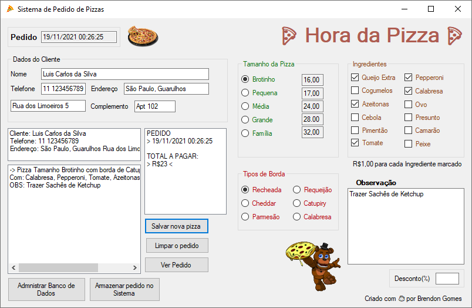
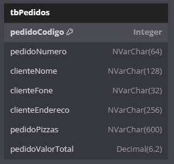

<h1 align="center">
  Pizza App VB.NET  🍕
</h1>

    
    

## 💻 Projeto

O Pizza App VB.NET 🍕 é um pequeno programa desktop para a criação e visualização de pedidos de pizzas de uma pizzaria (fictícia) chamada "Hora da Pizza".

Desenvolvido através da estrutura de interface do usuário Windows Forms com a linguagem de programação Visual Basic .NET, sendo os pedidos de pizzas, armazenados em um banco de dados do SQL Server.

    <kbd>
        
    </kbd>

## 📁 Estrutura da Tabela

    <kbd>
        
    </kbd>

A tabela `tbPedidos` foi estruturada para armazenar as seguintes informações sobre pedidos:

- **pedidoCodigo**: Um número inteiro usado como chave primária que incrementa automaticamente.
- **pedidoNumero**: Uma cadeia de caracteres de no máximo 64 caracteres que armazena o número do pedido.
- **clienteNome**: Uma cadeia de caracteres de no máximo 128 caracteres que contém o nome do cliente.
- **clienteFone**: Uma cadeia de caracteres de no máximo 32 caracteres para o número de telefone do cliente.
- **clienteEndereco**: Uma cadeia de caracteres de no máximo 256 caracteres que representa o endereço do cliente.
- **pedidoPizzas**: Uma cadeia de caracteres de no máximo 600 caracteres que armazena informações sobre as pizzas do pedido.
- **pedidoValorTotal**: Um número decimal com 6 dígitos no total e 2 casas decimais que representa o valor total do pedido.

## 🔥 Execução

- Para iniciar o programa desktop de controle de pedidos de pizas é necessário ter o SQL Server instalado localmente, então basta abrir o programa executável `vbnetPizzaApp.exe` localizado em [/vbnetPizzaApp/bin/Debug](./vbnetPizzaApp/bin/Debug)

### 🗃 Conectar com o banco de dados

Ao abrir o programa, basta seguir esses passos para configurar o banco de dados e aa tabela corretamente:

- Primeiramente clicar no botão escrito **"Administrar Banco de Dados"** localizado no canto inferior esquerdo
- Clicar no botão escrito **"Fazer Conexão Com SQL Server"**, ele retornará o nome da sua máquina instalada o SQL Server
- Clicar no botão escrito **"Criar Banco de Dados"**, para criar o banco de dados `Sistema_Pizzaria` no SQL Server
- Por fim resta clicar no botão escrito **"Criar Tabela de Pedidos"**, para criar a tabela `tbPedidos` no SQL Server
- Agora com o banco de dados configurado, é só manusear o programa

---

Feito para uma atividade de Desenvolvimento de Sistemas quando frequentava a Etec de Sapopemba

<h3 align="center">
    Feito com ☕ por <a href="https://github.com/Brendon3578"> Brendon Gomes</a>
</h3>
